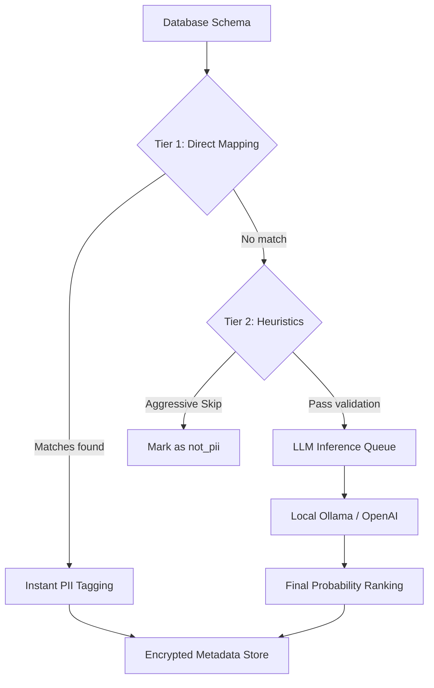

# 🛡️ Hardened PII Discovery Engine

[](https://www.python.org/)
[](https://fastapi.tiangolo.com/)
[](https://www.docker.com/)
[](https://ollama.ai/)
[](https://www.postgresql.org/)

**A premium, high-performance PII discovery and classification system.** Designed to secure PostgreSQL environments by identifying sensitive data using a hardened **Hybrid Detection Engine** (Direct Mapping + Heuristics + LLM).

---

## 🚀 The Hybrid Detection Engine

Unlike traditional regex-only tools, this engine utilizes a three-tiered classification pipeline to ensure maximum accuracy with minimal latency.



### 🧠 Core Features

*   **⚡ Beast Mode (GPU Parallelization)**: Leverages native GPU acceleration (Metal/CUDA) via local Ollama for near-instant scanning of massive schemas.
*   **🧩 Deep JSON Scanning**: Intelligent flattening of `JSONB` and nested JSON columns. It peers inside raw data strings to find hidden PII.
*   **🇹🇷 Hardened for Turkish Context**: Specialized identification logic for **TCKN** (Turkish Identity), **Tax Numbers**, **IBANs**, and domestic address formats.
*   **🎭 Masked Data Awareness**: Detects and correctly categorizes obfuscated data (e.g., `**** **** **** 1234`) as sensitive financial information.
*   **🛡️ Privacy-First Architecture**: Designed for air-gapped or high-security environments. Use local LLMs (Qwen/Llama) to ensure sensitive samples never leave your infrastructure.

---

## 💻 System Requirements

To ensure smooth PII classification and schema discovery, follow these hardware guidelines:

| Component | Minimum | Recommended |
| :--- | :--- | :--- |
| **RAM** | 8 GB | 16 GB+ |
| **GPU** | CPU-only is possible | Apple M-Series or NVIDIA (8GB+ VRAM) |
| **Storage** | 10 GB (for Docker + Models) | 20 GB+ (High-precision models) |
| **LLM Model** | `qwen2.5:3b` | `qwen2.5:7b` or `deepseek-r1:7b` |

> [!TIP]
> **Why Local Ollama?** Running Ollama natively on your host machine (outside Docker) allows the system to access your hardware acceleration (Metal or CUDA), resulting in **10x faster** processing compared to containerized CPU-bound inference.

---

## 🛠️ Quick Start

### 1. Configure Environment
```bash
cp .env.example .env
```
Generate your encryption key for secure credential storage:
```python
from cryptography.fernet import Fernet
print(Fernet.generate_key().decode())
```

### 2. Launch with Docker
```bash
docker-compose up --build
```
*   **API Docs**: `http://localhost:8000/docs`
*   **Performance Note**: For maximum speed, connect to a native Ollama instance on your host machine to utilize hardware acceleration.

---

## 📊 Supported PII Categories

The system classifies data into **13 distinct categories** with high-precision confidence scores:

| Category | Typical Pattern / Examples |
| :--- | :--- |
| `tckn` | 11-digit Turkish Identity Numbers (starts non-zero) |
| `credit_card_number` | Full or masked financial cards, IBANs, Account numbers |
| `email_address` | personal@domain.com, corporate_id@company.com |
| `phone_number` | Local and international formats (+90, 05xx, etc.) |
| `ip_address` | IPv4 and IPv6 addresses (detected via DB types or content) |
| `full_name` | Combined first and last names |
| `first_name` / `last_name` | Split name categorization (Ad / Soyad) |
| `home_address` | Street addresses, district, and city metadata |
| `date_of_birth` | Birthday records (distinguished from technical timestamps) |
| `social_security_number` | Identified as high-risk SSN patterns |
| `national_id_number` | Non-Turkish government identifiers and passports |
| `not_pii` | Safe technical metadata, IDs, amounts, and statuses |

---

## ⚙️ Advanced Configuration (Beast Mode)

To achieve **10x faster discovery**, bypass Docker's CPU limitations and use your host's GPU:

1.  Run **Ollama** natively on your Mac/Linux.
2.  Set `OPENAI_BASE_URL=http://host.docker.internal:11434/v1` in `.env`.
3.  The discovery pipeline will now use **Native Metal (Mac)** or **CUDA (NVIDIA)** for inference.

---

## 🔐 Security & Encryption

All target database credentials are stored using **AES-256 Fernet Encryption**. The `ENCRYPTION_KEY` is required at runtime to decrypt access tokens, ensuring your data warehouse remains secure even if the discovery database is compromised.

---

## 📜 Development & Contributions

### Local Setup (No Docker)
```bash
python -m venv .venv && source .venv/bin/activate
pip install -r requirements.txt
alembic upgrade head
uvicorn app.main:app --reload
```

### Async Architecture
The system utilizes a **Semaphore-controlled Async Pipeline** (`MAX_LLM_CONCURRENCY = 5`) to prevent overloading the inference host while maintaining high throughput for large-schema discovery.

---

## 🤖 AI-Native Development Workflow

This project was built using an **AI-Native approach**, leveraging **Cursor AI** to synchronize complex business logic across different technology stacks (Python & Java). 

### 🔄 Python-to-Java Porting with Cursor
The core PII Discovery logic was first perfected in Python and then ported to Java Spring Boot to ensure architectural consistency. This was achieved by providing the AI assistant with high-context prompts:

> **Prompt Example:**
> *"Analyze the `_call_llm` and `_validate_with_heuristics` functions in `app/classify/service.py`. Implement the exact same hybrid classification logic in a Spring Boot service. Ensure the 13 PII categories, prompt structure, and regex-based heuristics are identical to maintain cross-stack result parity."*

### ✅ Result Parity
By using AI-assisted porting:
*   **Prompt Alignment**: Both stacks use the exact same `SYSTEM_PROMPT`.
*   **Heuristic Parity**: Regular expressions and exclusion keywords (suffixes) are 1:1 identical.
*   **Rapid Synchronization**: Critical hardening updates in Python (like TCKN support) were propagated to the Java codebase in minutes rather than hours.

### 🧪 End-to-End Testing with Antigravity
The system's reliability was verified through an autonomous testing loop using the **Antigravity AI Agent**. Instead of manual smoke tests, the agent was tasked with monitoring the entire pipeline in real-time.

**Key Testing Prompts:**
> *"Monitor the Docker logs in real-time. Trigger the discovery scan and identify why the LLM is returning inconsistent categories for numeric IDs like TCKN. Once identified, apply a hardening fix to `service.py` and re-verify the scan."*

**The "Debug-Fix-Verify" Loop:**
1.  **Autonomous Log Analysis**: The AI agent inspected container logs to identify database connection port mismatches and LLM JSON hallucinations.
2.  **Real-Time Data Injection**: Custom SQL samples were injected into the test database to verify the detection of masked cards and Turkish tax numbers.
3.  **Regression Testing**: After every "Hardening" update, the agent autonomously re-ran the classification pipeline to ensure no regression in `email_address` or `ip_address` detection.

---
*Built for the Kafein Study Case by Ali Gökkaya.*
