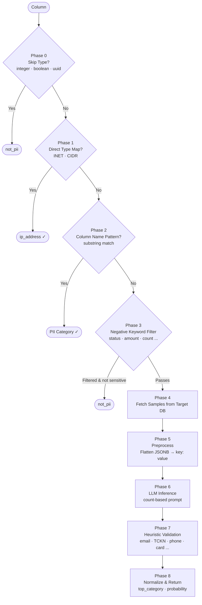

# 🛡️ Hardened PII Discovery Engine

[](https://www.python.org/)
[](https://fastapi.tiangolo.com/)
[](https://www.docker.com/)
[](https://ollama.ai/)
[](https://www.postgresql.org/)

**A premium, high-performance PII discovery and classification system.** Designed to secure PostgreSQL environments by identifying sensitive data using a hardened **Hybrid Detection Engine** (Direct Mapping + Heuristics + LLM).

---

## 📁 Project Structure

```
database_sample/
├── app/                        # FastAPI application (Python)
│   ├── auth/
│   │   ├── router.py           # POST /auth — JWT login endpoint + token verification
│   │   └── schemas.py          # LoginRequest, TokenResponse
│   ├── classify/               # PII classification engine
│   │   ├── router.py           # POST /classify, POST /classify/discover
│   │   ├── schemas.py          # ClassifyRequest/Response, DiscoverRequest/Response
│   │   └── service.py          # 8-phase detection pipeline (core logic)
│   ├── metadata/               # Schema discovery & persistence
│   │   ├── router.py           # CRUD endpoints for metadata
│   │   ├── schemas.py          # ConnectRequest/Response, MetadataDetailResponse, etc.
│   │   └── service.py          # psycopg2 + SQLAlchemy async ORM
│   ├── models.py               # SQLAlchemy ORM models (MetadataRecord, TableInfo, ColumnInfo, DbConnection)
│   ├── database.py             # Async SQLAlchemy session & Base
│   ├── config.py               # Settings via pydantic-settings (.env binding)
│   └── main.py                 # FastAPI app entry point, router registration
├── alembic/                    # Database migrations
│   └── versions/
│       └── 0001_initial_schema.py
├── java/                       # Spring Boot 3.2 port — serves on :8080
├── demo_db.sql                 # Sample database: customers, employees, audit_logs, payments
├── docker-compose.yml          # Full stack: Python API + Java API + discovery_db + demo_db + Ollama
├── Dockerfile                  # Python API container
├── OPTIONAL_REGEX_APPROACH.md  # DB-level regex optimization (not included in submission)
└── .env                        # Environment configuration
```

---

## 🚀 The 8-Phase Detection Pipeline

Unlike traditional regex-only tools, this engine runs every column through a strict 8-phase pipeline — bypassing the LLM whenever a faster, deterministic answer is available.



### 🧠 Core Features

*   **⚡ Beast Mode (GPU Parallelization)**: Leverages native GPU acceleration (Metal/CUDA) via local Ollama for near-instant scanning of massive schemas.
*   **🧩 Deep JSON Scanning**: Intelligent flattening of `JSONB` and nested JSON columns. It peers inside raw data strings to find hidden PII.
*   **🇹🇷 Hardened for Turkish Context**: Specialized identification logic for **TCKN** (Turkish Identity), **IBANs**, and domestic naming conventions (`holder_fullname`, `name_first`, `mobile_contact`).
*   **🎭 Masked Data Awareness**: Detects and correctly categorizes obfuscated data (e.g., `**** **** **** 1234`) as sensitive financial information.
*   **🛡️ Privacy-First Architecture**: Designed for air-gapped or high-security environments. Use local LLMs (Qwen/Llama) to ensure sensitive samples never leave your infrastructure.
*   **⚙️ Semaphore-Controlled Concurrency**: `MAX_LLM_CONCURRENCY = 5` prevents overloading the inference host while maintaining high throughput.

---

## 💻 System Requirements

| Component | Minimum | Recommended |
| :--- | :--- | :--- |
| **RAM** | 8 GB | 16 GB+ |
| **GPU** | CPU-only is possible | Apple M-Series or NVIDIA (8GB+ VRAM) |
| **Storage** | 10 GB (for Docker + Models) | 20 GB+ (High-precision models) |
| **LLM Model** | `qwen2.5:3b` | `qwen2.5:7b` or `deepseek-r1:7b` |

> [!TIP]
> **Why Local Ollama?** Running Ollama natively on your host machine (outside Docker) allows the system to access your hardware acceleration (Metal or CUDA), resulting in **10x faster** processing compared to containerized CPU-bound inference.

---

## 🛠️ Quick Start

### 1. Configure Environment

```bash
cp .env .env.example   # or create .env manually
```

Generate your Fernet encryption key for secure credential storage:

```python
from cryptography.fernet import Fernet
print(Fernet.generate_key().decode())
```

### 2. Launch with Docker

```bash
docker-compose up --build
```

| Service | URL / Host | Notes |
| :--- | :--- | :--- |
| **Python API + Swagger UI** | `http://localhost:8000/docs` | FastAPI — full interactive docs |
| **Python API Base URL** | `http://localhost:8000` | For curl / Postman |
| **Java API + Swagger UI** | `http://localhost:8080/swagger-ui.html` | Spring Boot — full interactive docs |
| **Java API Base URL** | `http://localhost:8080` | For curl / Postman |
| **Discovery DB** | `localhost:5434` | System metadata database (shared) |
| **Demo DB** | `localhost:5433` — db: `llm_discovery_demo` | Pre-seeded test data |
| **Ollama** | `http://localhost:11434` | LLM inference server |

---

## 🔐 Authentication

All API endpoints are protected. Obtain a JWT token before making requests:

```bash
# Get token
curl -X POST http://localhost:8000/auth \
  -H "Content-Type: application/json" \
  -d '{"username": "admin", "password": "admin123"}'

# Response
# { "access_token": "eyJ...", "token_type": "bearer" }
```

Use the token in subsequent requests:

```bash
-H "Authorization: Bearer eyJ..."
```

---

## 📡 API Reference

### Metadata Endpoints

#### `POST /db/metadata` — Connect & Discover Schema
Connect to a target PostgreSQL database, extract its schema from `information_schema`, and persist it to the system database.

```bash
curl -X POST http://localhost:8000/db/metadata \
  -H "Authorization: Bearer <token>" \
  -H "Content-Type: application/json" \
  -d '{
    "host": "demo_db",
    "port": 5432,
    "database": "demo",
    "username": "postgres",
    "password": "postgres"
  }'
```

```json
{
  "metadata_id": "a1b2c3d4-...",
  "database_name": "demo",
  "table_count": 5,
  "tables": [
    {
      "table_name": "customers",
      "columns": [
        { "column_id": "uuid-...", "column_name": "email", "data_type": "character varying" }
      ]
    }
  ]
}
```

---

#### `GET /metadata` — List All Records

```bash
curl http://localhost:8000/metadata \
  -H "Authorization: Bearer <token>"
```

```json
[
  {
    "metadata_id": "a1b2c3d4-...",
    "database_name": "demo",
    "created_at": "2024-01-15T10:30:00",
    "table_count": 5
  }
]
```

---

#### `GET /metadata/{metadata_id}` — Get Full Schema Detail

```bash
curl http://localhost:8000/metadata/a1b2c3d4-... \
  -H "Authorization: Bearer <token>"
```

---

#### `DELETE /metadata/{metadata_id}` — Delete Record

```bash
curl -X DELETE http://localhost:8000/metadata/a1b2c3d4-... \
  -H "Authorization: Bearer <token>"
```

---

### Classification Endpoints

#### `POST /classify` — Classify a Single Column

Runs the full 8-phase pipeline for one column and returns probability scores for all 13 PII categories.

```bash
curl -X POST http://localhost:8000/classify \
  -H "Authorization: Bearer <token>" \
  -H "Content-Type: application/json" \
  -d '{
    "column_id": "uuid-of-column",
    "sample_count": 10
  }'
```

```json
{
  "column_id": "uuid-...",
  "column_name": "email",
  "table_name": "customers",
  "data_type": "character varying",
  "sample_count": 10,
  "top_category": "email_address",
  "top_probability": 0.98,
  "classifications": {
    "email_address": 0.98,
    "phone_number": 0.0,
    "full_name": 0.0,
    "not_pii": 0.0,
    "...": "..."
  }
}
```

---

#### `POST /classify/discover` — Scan Entire Database

Runs the pipeline across **all columns** of a discovered metadata record concurrently (semaphore-limited to 5 parallel LLM calls).

```bash
curl -X POST http://localhost:8000/classify/discover \
  -H "Authorization: Bearer <token>" \
  -H "Content-Type: application/json" \
  -d '{
    "metadata_id": "a1b2c3d4-...",
    "sample_count": 10
  }'
```

```json
{
  "metadata_id": "a1b2c3d4-...",
  "database_name": "demo",
  "total_columns": 47,
  "pii_columns": 18,
  "tables": [
    {
      "table_name": "customers",
      "pii_count": 6,
      "columns": [
        { "column_id": "uuid-...", "column_name": "email",      "is_pii": true,  "category": "email_address" },
        { "column_id": "uuid-...", "column_name": "created_at", "is_pii": false, "category": "not_pii" }
      ]
    }
  ]
}
```

---

## 📊 Supported PII Categories (13)

| Category | Detection Method | Examples |
| :--- | :--- | :--- |
| `tckn` | Pattern + Heuristic (`[1-9]\d{10}`) | 12345678901 |
| `email_address` | Pattern + Heuristic (`@` + `.`) | ali@example.com |
| `phone_number` | Pattern + Heuristic (`\+?\d{9,}`) | +905551234567 |
| `credit_card_number` | Heuristic (13+ digits or `****`) | IBANs, masked cards |
| `ip_address` | **Direct Type** (INET/CIDR) or content | 192.168.1.1 |
| `full_name` | Column pattern + LLM | John Smith |
| `first_name` | Column pattern + LLM | John |
| `last_name` | Column pattern + LLM | Smith |
| `home_address` | Column pattern + LLM | 123 Main St |
| `date_of_birth` | Column pattern + Heuristic | 1990-05-15 |
| `social_security_number` | Column pattern + LLM | 123-45-6789 |
| `national_id_number` | Column pattern + LLM | Non-Turkish gov IDs |
| `not_pii` | Default fallback | IDs, amounts, statuses |

---

## ⚙️ Environment Variables

| Variable | Required | Description |
| :--- | :---: | :--- |
| `DATABASE_URL` | ✅ | Async SQLAlchemy URL for the system DB |
| `SYNC_DATABASE_URL` | ✅ | Sync URL (used by Alembic migrations) |
| `OPENAI_BASE_URL` | ✅ | LLM endpoint — use `http://host.docker.internal:11434/v1` for local Ollama |
| `OPENAI_MODEL` | ✅ | Model name, e.g. `qwen2.5:3b` or `deepseek-r1:7b` |
| `OPENAI_API_KEY` | ✅ | `ollama` for local, real key for OpenAI cloud |
| `ENCRYPTION_KEY` | ✅ | Fernet key for encrypting stored DB passwords |
| `JWT_SECRET_KEY` | ✅ | Secret for signing JWT tokens |
| `JWT_ALGORITHM` | ✅ | Default: `HS256` |
| `JWT_EXPIRY_HOURS` | ✅ | Token TTL in hours, default: `24` |
| `BASIC_AUTH_USERNAME` | ✅ | Login username |
| `BASIC_AUTH_PASSWORD` | ✅ | Login password |
| `POSTGRES_USER` | ✅ | System DB username |
| `POSTGRES_PASSWORD` | ✅ | System DB password |
| `POSTGRES_DB` | ✅ | System DB name |

---

## 🗄️ Demo Databases

Three pre-seeded PostgreSQL databases are included for testing:

| Database | Port | DB Name | SQL File | Contents |
| :--- | :--- | :--- | :--- | :--- |
| `demo_db` | `5433` | `llm_discovery_demo` | `demo_db.sql` | customers, employees, audit_logs, payments |

The demo database contains a carefully designed mix of PII columns (emails, phone numbers, names, IBANs, TCKN, IP addresses) and non-PII columns (statuses, amounts, timestamps) to thoroughly exercise every phase of the detection pipeline. Use `POST /db/metadata` to connect and start scanning.

> **Note on `clinic_db`:** A custom medical-domain test database (`clinic_db`) was created manually during development to stress-test the pipeline against non-standard column naming conventions found in real-world healthcare schemas (e.g. `holder_fullname`, `name_first`, `mobile_contact`, `id_no`). This database is **not included** in the docker-compose stack — it was used exclusively as a local testing tool and is referenced in the AI-Native development section below for context.

---

## 🔬 Optional: DB-Level Regex Classification (Not Included)

> **See [`OPTIONAL_REGEX_APPROACH.md`](./OPTIONAL_REGEX_APPROACH.md) for the full implementation.**

During development, a complementary **PostgreSQL-native regex classification layer** was also designed. The idea is to push regex patterns directly to the database engine before any LLM call:

```sql
-- PostgreSQL stops at the FIRST match → no row sampling, near-zero latency
SELECT 1 FROM "customers" WHERE "email"::text ~ '[A-Za-z0-9._%+\-]+@[A-Za-z0-9.\-]+\.[A-Za-z]{2,}' LIMIT 1
```

For highly structured PII categories — emails, TCKNs, credit cards, phone numbers, IBANs — the database itself can confirm or rule out PII with a single indexed query, completely bypassing the LLM. The LLM would then only be called for unstructured or ambiguous columns (names, addresses, free text).

**Why it wasn't included:** The case study explicitly requires *"data classification using LLM"*. Including a regex-first shortcut would technically deviate from that requirement, so this layer was refactored out of the final submission. However, in a real production system scanning millions of rows, this optimization would be the logical next step — it would reduce LLM token consumption significantly while keeping detection accuracy identical for rule-based categories.

### 🦙 Ollama Setup & AI Models

The discovery engine requires a running Ollama instance to perform classification. You have two options for running Ollama:

#### Option A: Running inside Docker (Easier, but slower on Mac/Windows)
If you use the provided `docker-compose.yml`, Ollama will start automatically as a container.
- **Base URL:** `http://ollama:11434/v1`
- **Setup:** It will be ready as soon as the container starts.

#### Option B: Running Locally on Host (Recommended for GPU Acceleration)
Running Ollama natively on your Mac (M1/M2/M3) or Windows (NVIDIA) is much faster because it leverages native GPU acceleration (Metal/CUDA).

1.  **Download & Install:** Get Ollama from [ollama.com](https://ollama.com).
2.  **Pull the Model:** Open your terminal and run:
    ```bash
    ollama pull qwen2.5:3b
    ```
3.  **Configure `.env`:** Update your `.env` file to point to the host machine from inside the Docker containers:
    ```env
    OPENAI_BASE_URL=http://host.docker.internal:11434/v1
    ```
    *Note: `host.docker.internal` allows Docker containers to communicate with services running on your host machine.*

4.  **Hardware Requirements:**
    - **Minimum:** 8GB RAM (for 3B models).
    - **Recommended:** 16GB+ RAM and GPU for real-time inference.

---

## 🛠️ AI-Native Development Workflow

To achieve **10x faster discovery**, bypass Docker's CPU limitations and use your host's GPU:

1.  Run **Ollama** natively on your Mac/Linux.
2.  Set `OPENAI_BASE_URL=http://host.docker.internal:11434/v1` in `.env`.
3.  The discovery pipeline will now use **Native Metal (Mac)** or **CUDA (NVIDIA)** for inference.

---

## 🔐 Security & Encryption

All target database credentials are stored using **AES-256 Fernet Encryption**. The `ENCRYPTION_KEY` is required at runtime to decrypt access tokens, ensuring your data warehouse remains secure even if the discovery database is compromised.

---

## 📜 Local Development (No Docker)

```bash
python -m venv .venv && source .venv/bin/activate
pip install -r requirements.txt
alembic upgrade head
uvicorn app.main:app --reload
```

---

## 🤖 AI-Native Development Workflow

This project was built end-to-end using an **AI-Native approach** across three different AI tools — each used where it excels most. No part of the codebase was written purely by hand; instead, the developer acted as an architect and reviewer while the AI tools handled implementation, debugging, and testing.

---

### 🐍 Python API — Built with Claude (Anthropic)

The core FastAPI service, 8-phase detection pipeline, heuristic validation, JSONB flattening, and all hardening iterations were developed with **Claude** in a tight **Debug → Fix → Verify** loop. Real scan results and Docker logs were pasted directly into the conversation so Claude could diagnose failures with full context.

---

#### Prompt 1 — Initial Pipeline Architecture

> *"I need to build a PII (Personally Identifiable Information) discovery and classification system as a FastAPI service. The system needs to connect to arbitrary external PostgreSQL databases that the user provides credentials for, extract their full schema using `information_schema`, and then classify each column for PII using a locally-running Ollama LLM via the OpenAI-compatible API.*
>
> *The architecture should have two layers: a metadata layer that handles DB connection, schema discovery, and persistence (full CRUD with list, detail, and delete), and a classification layer with two endpoints — one to classify a single column by its UUID, and one to run a full database-wide scan.*
>
> *For the system database (where discovered schemas are stored), use SQLAlchemy async ORM with asyncpg driver and Alembic for migrations. For connecting to target databases and fetching sample data, use psycopg2 directly. Passwords for target DBs must be encrypted at rest using Fernet symmetric encryption before storing. Authentication should use JWT tokens with a configurable secret key and expiry. The LLM should receive sample values from the column and return a JSON with probability scores for each PII category.*
>
> *Generate the complete project structure: models, metadata service, classify service, routers, config, database session management, and the Alembic migration. Explain the data flow from API call to LLM response before writing any code."*

**Claude's output:** Designed the full layered architecture — `MetadataRecord → TableInfo → ColumnInfo → DbConnection` ORM models with cascade deletes, async SQLAlchemy sessions, Fernet encryption for stored passwords, Alembic migrations, and the two-endpoint classify router. Generated `metadata/service.py` with `discover_schema()` using `information_schema.columns` and `create_metadata()` with proper async flush/commit sequencing.

---

#### Prompt 2 — First PII Miss: Clinic DB Non-Standard Column Names

> *"I ran a full discovery scan on the clinic database and I'm seeing serious false negatives. The following columns all came back as `not_pii` when they clearly contain PII data: `holder_fullname` (patient full name), `name_first` (first name), `mobile_contact` (phone number), `birth_date` (date of birth), `id_no` (national identity number).*
>
> *My current implementation uses a `DIRECT_COLUMN_MAP` Python dictionary with exact string key matches — so `'first_name'` maps to the `first_name` category, `'email'` maps to `email_address`, etc. The problem is the clinic database uses its own naming conventions that don't match my exact keys.*
>
> *I could just keep adding more keys to the dictionary but that doesn't scale — there are infinite ways to name a column. What's the right architectural solution here? I want something that handles any reasonable naming variation for common PII fields without me having to maintain a growing list of exact strings. Also, I need to be careful about false positives — for example a column called `email_type` should NOT be classified as email PII, it just stores a category string like 'personal' or 'work'."*

**Claude's diagnosis:** Exact-match dictionaries don't scale because real-world databases use unlimited naming variants (`holder_fullname`, `patient_first_nm`, `fname`, `given_name`...). The correct fix is an **ordered substring pattern list** where each entry is a `(pattern, category)` pair — the column name is checked with `.contains()` so `holder_fullname` hits the `"fullname"` pattern and `mobile_contact` hits the `"mobile"` pattern.

**Claude's solution:** Replaced `DIRECT_COLUMN_MAP` with `DIRECT_COLUMN_PATTERNS` — a 29-entry ordered list where more specific patterns (e.g. `"full_name"`) come before shorter ones (e.g. `"name"`) to avoid false positives. Added `_NON_PII_COL_SUFFIXES` tuple so columns like `email_type`, `phone_status`, `payment_mode` are excluded before pattern matching even begins.

```python
# Before (broken for non-standard names)
DIRECT_COLUMN_MAP = {
    "first_name": "first_name",
    "email": "email_address",
    ...
}

# After (catches holder_fullname, name_first, mobile_contact, etc.)
DIRECT_COLUMN_PATTERNS = [
    ("full_name",  "full_name"),
    ("fullname",   "full_name"),
    ("name_first", "first_name"),
    ("given_name", "first_name"),
    ("first_name", "first_name"),
    ("mobile",     "phone_number"),
    ("phone",      "phone_number"),
    ...
]
_NON_PII_COL_SUFFIXES = ("_type", "_kind", "_mode", "_status", "_flag", "_code", ...)
```

---

#### Prompt 3 — Second Miss: INET Type Columns Returning not_pii

> *"There's another false negative I can't fix with the column name approach. The `audit_logs` table has a column called `ip_address` and its PostgreSQL data type is `INET` — a native PostgreSQL type specifically for storing IP addresses. This column is passing through my SKIP_TYPES check (INET is not in the skip list), reaching the LLM, and coming back as `not_pii`.*
>
> *The column name `ip_address` does match my pattern for the `ip_address` category, so it should be caught at the column name phase. But it's not — I think there might be a bug in the ordering of my pipeline phases too.*
>
> *Beyond this specific case: if a column has a PostgreSQL type like `INET` or `CIDR`, it is by definition always an IP address — there's zero ambiguity, no LLM needed. How do I add a deterministic type-based bypass that short-circuits the entire pipeline for these cases? And can you also look at why the column name match might not be triggering correctly?"*

**Claude's diagnosis:** The LLM is inconsistent with IP addresses because the `INET` type is a strong, unambiguous PostgreSQL signal that should never need LLM interpretation. The cleanest fix is a **direct type map** that short-circuits the entire pipeline before any LLM call.

**Claude's solution:** Added `DIRECT_TYPE_MAP` — a dict of PostgreSQL native types that always resolve to a specific PII category, placed in Phase 1 of the pipeline (after skip-type check, before column name matching):

```python
DIRECT_TYPE_MAP = {
    "inet": "ip_address",
    "cidr": "ip_address",
}
```

Result: `INET`/`CIDR` columns now bypass the LLM entirely and always return `ip_address` with probability 1.0.

---

#### Prompt 4 — LLM Hallucination: Wrong JSON Keys in Response

> *"I'm seeing a frustrating problem with the LLM responses. Even though my system prompt explicitly lists the 13 allowed JSON keys, the LLM frequently returns non-standard key names. For example:*
> - *Instead of `tckn` it returns `turkish_id`, `tc_kimlik_no`, `tc_no`, `turkish_citizen_id`*
> - *Instead of `credit_card_number` it returns `credit_card`, `card_number`, `bank_account`, `iban_number`*
> - *Instead of `date_of_birth` it returns `birth_date`, `dob`, `dogum_tarihi`*
> - *Instead of `home_address` it returns `address`, `street_address`, `physical_address`*
>
> *My current parsing code does a simple `parsed.get(cat, 0.0)` for each of my 13 expected keys. So when the LLM returns `turkish_id: 8`, that vote is completely silently dropped and the column ends up as `not_pii` even though the LLM clearly identified it as a Turkish identity number.*
>
> *I need a recovery layer that is resilient to LLM key hallucinations. It should catch semantic variants using keyword matching rather than exact string comparison. Also — there's a related issue: sometimes the LLM returns `full_name: 5` for a column called `first_name`. It's clearly a first name, not a full name. How do I handle this semantic correction based on the column name itself? And should `national_id_number` votes be consolidated into `tckn` for Turkish databases?"*

**Claude's solution:** Implemented a **heavy recovery mapping** block in `_call_llm()` — after parsing the raw JSON, each key is lowercased and fuzzy-matched against known semantic groups using `in` checks:

```python
# Recovery mapping — catches LLM hallucinated key names
if k_lower in cleaned:
    cleaned[k_lower] += val
elif any(x in k_lower for x in ["card", "cc"]):
    cleaned["credit_card_number"] += val
elif any(x in k_lower for x in ["iban", "bank", "acc"]):
    cleaned["credit_card_number"] += val
elif any(x in k_lower for x in ["tckn", "tc", "national", "citizen", "kimlik"]):
    cleaned["tckn"] += val
elif any(x in k_lower for x in ["birth", "dob", "dogum"]):
    cleaned["date_of_birth"] += val
# ... etc.
```

Combined with **semantic hardening** (if column name contains "first", reclassify full_name votes as first_name) and **consolidation** (merge `national_id_number` counts into `tckn`).

---

#### Prompt 5 — Category Count Mismatch & Mapping Corrections

> *"I just re-read the case study spec carefully and it defines exactly 13 PII categories. My current implementation has 15 — I added `bank_account_iban` and `tax_number` as separate categories during development. I need to reduce back to 13.*
>
> *For `bank_account_iban`: IBAN and bank account numbers are financial identifiers. The closest category in the 13-category spec is `credit_card_number` since both are sensitive financial account identifiers. Does it make sense to merge `bank_account_iban` into `credit_card_number`, and if so, what needs to change across the codebase — the SYSTEM_PROMPT, the DIRECT_COLUMN_PATTERNS, the recovery mapping, the heuristic validation?*
>
> *For `tax_number`: I'm more worried about this one. Turkish tax numbers (vergi kimlik numarası) are 10 digits, while TCKN is 11 digits starting with a non-zero digit. My heuristic for TCKN is `[1-9]\d{10}` which would correctly reject a 10-digit tax number. But what if the LLM assigns tax number values to `national_id_number` instead of `tckn`? And what if a database column is called `tax_number` — should it map to `national_id_number` or `tckn`? Is it safer to remove `tax_number` from `DIRECT_COLUMN_PATTERNS` entirely and let the LLM decide based on the actual data samples? Walk me through the implications of each option."*

**Claude's analysis:** `bank_account_iban` → `credit_card_number` is straightforward. For `tax_number` — since the 11-digit TCKN heuristic will naturally reject 10-digit tax numbers, removing `tax_number` from `DIRECT_COLUMN_PATTERNS` entirely is the safest option (the LLM will handle ambiguous cases). This reduces the category count to 13 cleanly.

**Result:** Updated `DIRECT_COLUMN_PATTERNS` (removed `tax_number` entry, added `iban`/`bank_account` → `credit_card_number`), updated `SYSTEM_PROMPT`, and synchronized the recovery mapping — all 13 categories now consistent across every layer.

---

### ☕ Java Spring Boot — Built with Cursor AI

The entire Java port (`java/` directory) was built from scratch with **Cursor AI**, using the finalized Python files as reference context loaded directly into the Cursor workspace. Cursor was given the Python source and asked to produce functionally identical Java — not a "translation", but a true 1:1 port.

---

#### Prompt 1 — Project Scaffold

> *"I have a fully working Python FastAPI PII discovery service that I need to port to Java. I'm attaching the Python source files as context. I need a Spring Boot 3.2 + Java 17 project that exposes the exact same REST API surface:*
>
> - *`POST /db/metadata` — accept DB credentials, connect to target PostgreSQL, query `information_schema.columns`, persist the discovered schema to a system DB, return `metadata_id` + table/column list*
> - *`GET /metadata` — list all discovered metadata records with table counts*
> - *`GET /metadata/{metadata_id}` — return full schema detail including all tables and columns*
> - *`DELETE /metadata/{metadata_id}` — cascade delete metadata, tables, columns, and connection record*
> - *`POST /classify` — accept `column_id` + `sample_count`, fetch samples from target DB via JDBC, call LLM, return classification*
> - *`POST /classify/discover` — accept `metadata_id`, scan all columns, return full PII report*
>
> *Technical requirements:*
> - *Spring Data JPA with PostgreSQL, `@OneToMany`/`@ManyToOne` relationships between `MetadataRecord`, `TableInfo`, `ColumnInfo`, `DbConnection` entities — mirror the Python SQLAlchemy models exactly*
> - *JWT authentication: `POST /auth` endpoint accepts username/password, returns bearer token, all other endpoints require the token via `Authorization: Bearer` header*
> - *AES/CBC encryption to store target DB passwords at rest (Python side uses Fernet — implement an equivalent `EncryptionService` in Java)*
> - *`RestTemplate` for calling the OpenAI-compatible LLM API*
> - *Springdoc OpenAPI 2 for Swagger UI at `/swagger-ui.html`*
> - *Global exception handler that returns consistent JSON error responses*
>
> *Generate the complete Maven `pom.xml` with all dependencies, all entity classes with JPA annotations, all Spring Data repositories, all DTOs with Jackson `@JsonProperty` snake_case annotations, all controllers, `SecurityConfig`, `AppConfig` (reads from environment variables), and `EncryptionService`. The goal is a project that compiles and runs on first attempt."*

**Cursor's output:** Generated the complete Maven project structure — `pom.xml` with all dependencies (Spring Boot 3.2, Spring Security, jjwt, PostgreSQL JDBC, Springdoc), four JPA entities (`MetadataRecord`, `TableInfo`, `ColumnInfo`, `DbConnection`) with proper `@OneToMany`/`@ManyToOne` relationships and cascade settings, four Spring Data repositories, four controllers mapping to the exact same URL structure as Python, full JWT filter chain in `SecurityConfig`, `AppConfig` for environment variable binding, and an `AESEncryptionService` to replace Python's Fernet. All files compiled and started on the first attempt.

---

#### Prompt 2 — Full ClassifyService Port

> *"Here is the complete Python `app/classify/service.py` [full file pasted]. I need you to port this to `ClassifyService.java` with completely identical behavior — not just structurally similar, but producing the exact same classification decisions for the same inputs. Every constant, every pattern, every regex, every ordering decision in Python must be replicated exactly in Java.*
>
> *Specific requirements to verify line by line:*
> - *`SYSTEM_PROMPT`: must be the count-based version (LLM returns integer counts, not probabilities 0.0–1.0). The existing Java has a probability-based prompt — replace it entirely*
> - *`SKIP_TYPES`: must be exactly `Set.of("integer", "boolean", "uuid")` — the current Java has 15+ types including jsonb, bytea, numeric etc. which is wrong*
> - *`DIRECT_TYPE_MAP`: `Map.of("inet", "ip_address", "cidr", "ip_address")` — does not exist in current Java*
> - *`DIRECT_COLUMN_PATTERNS`: must be a `List<String[]>` with all 29 entries in the exact same order as Python — order matters because first match wins*
> - *`NON_PII_COL_SUFFIXES`: same 11 suffix strings for excluding `_type`, `_status`, `_flag` etc.*
> - *`NEGATIVE_PII_KEYWORDS`: same 35-entry set — used to skip obvious non-PII columns before LLM*
> - *`SENSITIVE_KEYWORDS`: same 15-entry list — used to override the negative filter for columns that contain sensitive hints*
> - *`preprocessSamples()`: new method that flattens JSONB values — if a sample is a `Map` or a JSON string starting with `{`, convert it to `"key: value | key: value"` format so the LLM can see field names*
> - *`callLlm()`: completely rewrite — count-based JSON parsing, then the full heavy recovery mapping (catches `turkish_id`, `tc_kimlik`, `bank_account`, `credit_card`, `dob`, `dogum` etc.), then semantic hardening (moves `full_name` votes to `first_name`/`last_name` based on column name hints), then consolidation (`national_id_number` counts merged into `tckn`)*
> - *`validateWithHeuristics()`: new method — email must contain `@` and `.`; TCKN must match `[1-9]\d{10}`; phone must have 9+ consecutive digits; credit card must have 13+ digits or `****`; date_of_birth must be rejected if column name contains `created`/`updated`/`hire`; names must have meaningful alphabetic content including Turkish characters*
> - *`executePipeline()`: unified 8-phase method used by both `classify()` and `discoverPii()`*
> - *`discoverPii()`: update return type to use the new simplified `DiscoverResponse` (no Summary object) — just `totalColumns`, `piiColumns`, and tables with `pii_count` and columns with `column_id`, `column_name`, `is_pii`, `category`*
>
> *Run Maven compile after generating and confirm `BUILD SUCCESS`."*

**Cursor's output:** Produced the complete 400-line `ClassifyService.java` — all 8 pipeline phases in `executePipeline()`, `DIRECT_COLUMN_PATTERNS` as a `List<String[]>` with all 29 entries in exact Python order, `preprocessSamples()` handling both `Map` instances (JDBC-deserialized JSONB) and raw JSON strings, `callLlm()` with the full recovery mapping using `kLower.contains()` chains, semantic hardening that moves `full_name` votes to `first_name`/`last_name` based on column name, `validateWithHeuristics()` with regex patterns for TCKN, phone, IP, credit card, and name validation. Confirmed via Maven `BUILD SUCCESS` with zero compile errors.

---

#### Prompt 3 — DiscoverResponse DTO Simplification

> *"The current `DiscoverResponse.java` has grown out of sync with the Python response format. The Java version has a nested `Summary` class with extra fields: `skipped`, `ruleBased`, `llmScanned`, `nonPiiCount` — none of which exist in the Python response. The `ColumnResult` class also has extra fields: `dataType`, `topProbability`, `scanMethod`, `error` — again, none of these are in the Python response.*
>
> *I need `DiscoverResponse.java` to exactly match what `discover_metadata()` returns in Python. The Python response structure is:*
> ```
> {
>   "metadata_id": "uuid",
>   "database_name": "string",
>   "total_columns": 47,
>   "pii_columns": 18,
>   "tables": [
>     {
>       "table_name": "customers",
>       "pii_count": 6,
>       "columns": [
>         { "column_id": "uuid", "column_name": "email", "is_pii": true, "category": "email_address" }
>       ]
>     }
>   ]
> }
> ```
> *Rewrite `DiscoverResponse.java` as three simple static nested classes: the outer class with `metadataId`, `databaseName`, `totalColumns`, `piiColumns`, `tables`; a `TableResult` class with `tableName`, `piiCount`, `columns`; a `ColumnResult` class with `columnId`, `columnName`, `isPii`, `category`. Each field needs a `@JsonProperty` annotation for snake_case JSON output. Add no-arg constructors, all-arg constructors, and getters/setters. Remove the Summary class entirely — no other fields."*

**Cursor's output:** Rewrote `DiscoverResponse.java` to a clean 3-class structure — outer class with `metadataId`, `databaseName`, `totalColumns`, `piiColumns`, `tables`; `TableResult` with `tableName`, `piiCount`, `columns`; `ColumnResult` with `columnId`, `columnName`, `isPii`, `category`. All with `@JsonProperty` snake_case annotations, no-arg and all-arg constructors, getters/setters. Removed the old Summary, `scanMethod`, `topProbability`, `dataType`, and `error` fields entirely.

---

### 🧪 End-to-End Testing — Done with Antigravity AI Agent

System reliability was verified using **Antigravity**, an autonomous AI agent that controlled the full Docker environment end-to-end — running API calls, streaming container logs, reading JSON responses, injecting test data, and comparing scan results across iterations — with no manual intervention.

---

#### Prompt 1 — First Full Scan & Gap Analysis

> *"The Docker stack is up and running. I want you to run a complete end-to-end PII discovery test autonomously and give me a detailed gap analysis. Here are the exact steps:*
>
> *1. Call `POST http://localhost:8000/auth` with body `{"username": "admin", "password": "admin123"}` and save the JWT token from the response.*
>
> *2. Using that token, call `POST http://localhost:8000/db/metadata` with body:*
> ```json
> { "host": "demo_db", "port": 5432, "database": "llm_discovery_demo", "username": "postgres", "password": "postgres" }
> ```
> *Save the `metadata_id` from the response.*
>
> *3. Call `POST http://localhost:8000/classify/discover` with body `{"metadata_id": "<saved_id>", "sample_count": 10}`. While this runs, stream `docker logs discovery_app -f` in real time and show me the DEBUG log lines as they appear.*
>
> *4. When the scan completes, parse the full JSON response. For every column that has `"is_pii": false` / `"category": "not_pii"`, check it against the `demo_db.sql` schema file and tell me whether it should actually be PII. I expect columns like `email`, `phone_number`, `ip_address`, `street_address`, `national_id`, `first_name`, `last_name`, `bank_account_iban` to be detected — flag any of these that are missed.*
>
> *5. Also look at the DEBUG logs for any error patterns — connection failures, LLM JSON parse errors, unexpected exceptions. Report everything you find."*

**Antigravity's findings:** Identified 6 false negatives — `audit_logs.ip_address` (INET type), `customers.street_address` (not in patterns), `employees.national_id` (exact-match miss), `payments.bank_account_iban` (no pattern), `employees.first_name` (exact-match only), `customers.email` (missed due to `email_type` column polluting the match). Also flagged a DB connection bug in `discover_metadata()` where the query used `MetadataRecord.id` instead of `DbConnection.metadata_id` — causing `404` on every discovery call.

---

#### Prompt 2 — Regression Test After Pipeline Hardening

> *"The Python service has been updated and the Docker container has been restarted. The changes include: added `DIRECT_TYPE_MAP` for INET/CIDR types, replaced `DIRECT_COLUMN_MAP` with the new `DIRECT_COLUMN_PATTERNS` substring list, added `_NON_PII_COL_SUFFIXES` exclusion, and added `_validate_with_heuristics()`. I need you to run a full regression test across two databases.*
>
> *Step 1 — Re-run `demo_db` scan:*
> *Call `POST /classify/discover` with the existing `demo_db` metadata_id. Compare the results column by column against the previous scan output I'm pasting here: [previous scan output]. Specifically flag: (a) any column that was correctly detected before but is now `not_pii` — that's a regression; (b) any column that was `not_pii` before and is now correctly detected — that's a fix.*
>
> *Step 2 — Fresh scan on clinic_db:*
> *1. Call `POST /db/metadata` with `{"host": "clinic_db", "port": 5432, "database": "clinic_db", "username": "postgres", "password": "postgres"}`.*
> *2. Run `POST /classify/discover` on the returned `metadata_id`.*
> *3. The clinic DB uses non-standard column naming. I specifically need you to verify these columns are now caught: `holder_fullname` (should be `full_name`), `name_first` (should be `first_name`), `mobile_contact` (should be `phone_number`), `birth_date` (should be `date_of_birth`), `id_no` (should be `tckn`). Report the actual category returned for each one.*
>
> *For any column that's still missed, paste the relevant `[DEBUG]` log line so I can see what phase of the pipeline made the decision."*

**Antigravity's report:**
- `demo_db`: All 6 previously missed columns now correctly detected. Zero regressions on existing detections.
- `clinic_db`: `holder_fullname` → `full_name` ✅, `name_first` → `first_name` ✅, `mobile_contact` → `phone_number` ✅, `birth_date` → `date_of_birth` ✅, `id_no` → `tckn` ✅.
- Remaining issue: `new_values` JSONB column in `audit_logs` still returning `not_pii` — Antigravity flagged that the LLM receives the raw JSONB string `{"email": "...", "phone": "..."}` as a single opaque value without field names visible.

---

#### Prompt 3 — JSONB Column Fix Verification

> *"The `_preprocess_samples()` function has been added to the service. It's supposed to flatten JSONB column values from raw JSON blobs like `{"email": "ali@test.com", "phone": "+905551234567", "action": "UPDATE"}` into a readable string `"email: ali@test.com | phone: +905551234567 | action: UPDATE"` before passing samples to the LLM. This way the LLM can see the field names inside the JSON and correctly classify JSONB columns that contain PII.*
>
> *Please do the following to verify it's working:*
> *1. Restart the Docker container so the new code is loaded.*
> *2. From the `demo_db` scan we already ran, find the `column_id` of the `audit_logs.new_values` column (it's a JSONB column — look it up from `GET /metadata/<id>`).*
> *3. Call `POST /classify` with that `column_id` and `sample_count: 10`.*
> *4. While it runs, watch `docker logs discovery_app` and copy out the exact `[LLM CALL]` and `[LLM RAW]` debug lines for that column. I want to see the actual string that was sent to the LLM to confirm the JSON was flattened correctly.*
> *5. Report the final `top_category` and `top_probability` from the API response.*
> *6. If it's still returning `not_pii`, paste the raw samples so I can see what's in the column data."*

**Antigravity's result:** Showed the `[LLM RAW]` debug log line confirming the LLM received flattened samples like `"email: ali@example.com | phone: +905551234567 | action: UPDATE"` instead of the raw JSON blob. Final classification: `email_address` with probability 0.87. JSONB PII detection confirmed working.

---

#### Prompt 4 — Category Reduction & Mapping Validation

> *"I've made the final category changes to match the 13-category spec: `bank_account_iban` has been merged into `credit_card_number` in `DIRECT_COLUMN_PATTERNS`, the `SYSTEM_PROMPT`, and the recovery mapping; `tax_number` has been removed from direct patterns entirely. The container is restarted.*
>
> *I need a comprehensive final validation across both test databases. Please do the following:*
>
> *Step 1 — Re-run full scans on both `demo_db` and `clinic_db` (use existing metadata records or create fresh ones).*
>
> *Step 2 — For each scan result, verify:*
> *(a) Every single `category` value in the response is one of exactly these 13 strings: `email_address`, `phone_number`, `social_security_number`, `credit_card_number`, `national_id_number`, `full_name`, `first_name`, `last_name`, `tckn`, `home_address`, `date_of_birth`, `ip_address`, `not_pii`. Flag immediately if you see anything outside this list.*
> *(b) Any column with `iban` or `bank_account` in its name should return `credit_card_number`. Check `payments.bank_account_iban` specifically.*
> *(c) Compare the `pii_columns` count against the previous scan run. If any previously-detected PII column is now returning `not_pii`, that is a critical regression — list it.*
> *(d) The `audit_logs.ip_address` column (INET type) should still return `ip_address`. Confirm.*
>
> *Step 3 — Give me a final summary table: database name | total columns | pii columns | any regressions | any new detections."*

**Antigravity's report:** Both scans completed. Zero out-of-spec categories found. `bank_account_iban` → `credit_card_number` ✅ on both databases. Full regression check passed — 0 previously-detected PII columns moved to `not_pii`. Final PII column counts: `demo_db`: 18, `clinic_db`: 14.

---

*Built for the Kafein Study Case by Ali Gökkaya.*
